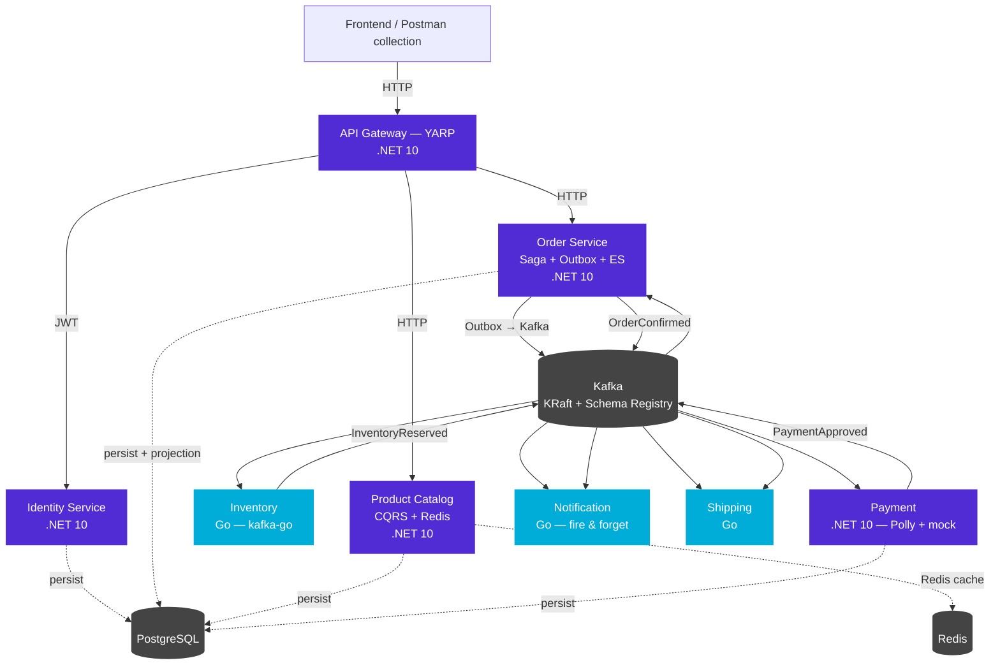

# Event-Driven Commerce Platform

An asynchronous e-commerce platform, built to demonstrate event-driven
architecture in a senior backend portfolio. The system is polyglot
(.NET 10 for services with complex domain logic + Go for lightweight
consumers) and uses Kafka as the messaging backbone, applying the
**Saga (orchestrated)**, **Outbox**, **CQRS**, and **Event Sourcing**
patterns.

## Architecture



## Stack

| Layer | Technology |
|---|---|
| API Gateway | .NET 10 + YARP |
| AuthN/AuthZ | .NET 10 + Duende IdentityServer (JWT/OIDC) |
| Product Catalog | .NET 10 + MediatR (CQRS) + Redis |
| Order Service | .NET 10 + Orchestrated Saga + Outbox + Event Sourcing |
| Payment | .NET 10 + Polly (Circuit Breaker/Retry) |
| Inventory / Notification / Shipping | Go + kafka-go |
| Messaging | Apache Kafka (KRaft) + Schema Registry (Avro) |
| Persistence | PostgreSQL (one database per service) |
| Cache / Idempotency | Redis |
| Structured logging | Serilog (.NET) + zerolog (Go) → Seq |

## Patterns applied

- **Orchestrated Saga** — compensatable purchase flow in the Order Service.
- **Outbox Pattern** — atomicity between the DB commit and event publishing.
- **CQRS** — Product Catalog with optimized read models and Redis cache.
- **Event Sourcing** — Order modeled as an append-only event stream + projections.
- **Idempotency** — consumers with an idempotency key in Redis.
- **Schema Registry (Avro)** — versioned contracts between producer and consumer.
- **Observability** — W3C trace context propagated in the headers of every event.

## Repository layout

```
event-driven-commerce-platform/
├── docs/
│   ├── architecture/diagrams/
│   ├── adr/                ← Architecture Decision Records
│   └── runbook/
├── src/
│   ├── api-gateway/        .NET 10 (YARP)
│   ├── services/
│   │   ├── identity/       .NET 10
│   │   ├── product/        .NET 10 (CQRS)
│   │   ├── order/          .NET 10 (Saga + Outbox + ES)
│   │   ├── payment/        .NET 10
│   │   ├── inventory/      Go
│   │   ├── shipping/       Go
│   │   └── notification/  Go
│   └── shared/
│       ├── contracts/      shared Avro schemas
│       └── observability/
└── deploy/
    ├── docker-compose.yml
    └── postgres/
```

## Bring up the platform infrastructure

> Prerequisite: Docker (engine 24+) with the Compose v2 plugin.

```bash
cd deploy
docker compose up -d
docker compose ps            # validate service status
```

Exposed endpoints (after bringing it up):

| Service | URL | Usage |
|---|---|---|
| Kafka (host) | `localhost:9092` | bootstrap for local clients |
| Schema Registry | `http://localhost:8081` | Avro contracts |
| Kafka UI | `http://localhost:8080` | visual inspection of topics/groups |
| PostgreSQL | `localhost:15432` (edcp/edcp_dev) | per-service databases |
| Redis | `localhost:6379` | cache / idempotency |
| Seq | `http://localhost:8082` | structured logs |

The `identity`, `product`, `order`, `payment`, and `inventory` databases
are created automatically on the first Postgres startup.

## Decision documentation (ADRs)

Architectural decisions are recorded in `docs/adr/`. The index starts at
`ADR-001` (the polyglot .NET + Go stack decision). See the other ADRs as
they are added.